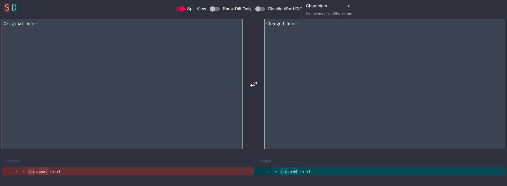

# simple-diff


#### simple-diff is a simple to use online diff tool.

---



## Installation

### Docker

Docker images are available on [GHCR](https://github.com/users/mheidinger/packages/container/package/simple-diff).

### Compiling and running locally

Install all dependencies with npm
```
npm install
```

Run the app in the development mode.
Open [http://localhost:3000](http://localhost:3000) to view it in the browser.
```
npm start
```

Builds the app for production to the `build` folder.<br />
It correctly bundles React in production mode and optimizes the build for the best performance.
```
npm run build
```
